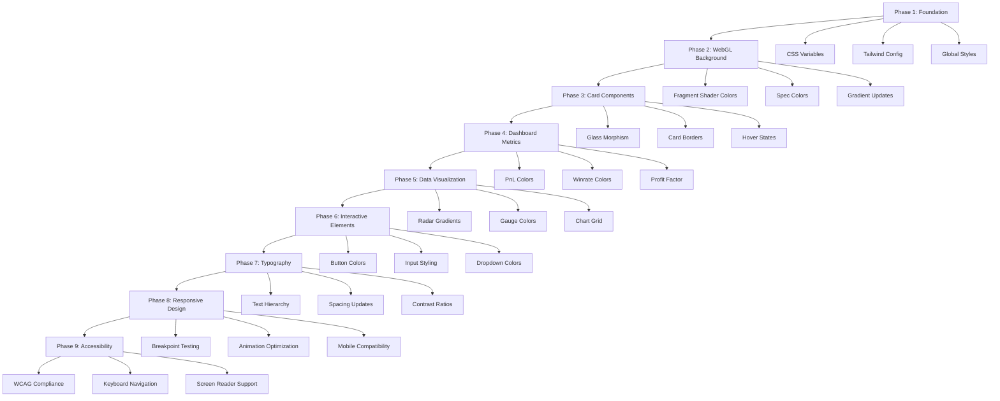

# Trading Journal Color System Implementation Plan
## Transforming from Green/Blue Glass Morphism to Warm Editorial Earth Tones

### Overview
This plan outlines the systematic transformation of the trading journal website from its current green/blue glass morphism theme to a warm, editorial, premium aesthetic with muted earth tones. The transformation will maintain the existing glass morphism effects while replacing the color palette and creating a more sophisticated, typography-focused design.

### Target Color Palette
- **Deep Charcoal** (#121212) - Main background
- **Soft Graphite** (#202020) - Cards/panels
- **Warm Off-White** (#EAE6DD) - Main text
- **Muted Gray** (#9A9A9A) - Secondary text
- **Rust Red** (#A7352D) - Statement accent
- **Warm Sand/Cream** (#D6C7B2) - Highlight
- **Muted Olive Green** (#4F5B4A) - Tertiary accent
- **Dusty Gold** (#B89B5E) - Secondary accent

### Implementation Phases

## Phase 1: Foundation - Color System & Global Styles (Highest Impact)
**Files to modify:**
- `src/app/globals.css` (lines 8-2625)
- `tailwind.config.js` (lines 8-137)

**Tasks:**
1. Define CSS custom properties for the new color palette
2. Update base HTML/body styles with new background and text colors
3. Replace all green/blue color variables with warm earth tones
4. Update Tailwind config to include new color scheme
5. Transform scrollbar styling to match new theme

## Phase 2: WebGL Background Transformation
**Files to modify:**
- `src/components/Balatro.tsx` (lines 94-216)

**Tasks:**
1. Replace green/blue gradient colors in fragment shader
2. Update "little specs" colors to warm earth tones
3. Modify gradient direction and color stops
4. Ensure animation maintains subtle, premium feel
5. Test WebGL context and performance

## Phase 3: Card & Component Styling
**Files to modify:**
- `src/components/ui/DashboardCard.tsx` (lines 105-158)
- `src/components/ui/DominantEmotionCard.tsx`
- `src/components/ui/VRatingCard.tsx`
- All other card components

**Tasks:**
1. Update glass morphism classes with new colors
2. Transform card borders and backgrounds
3. Update hover states and transitions
4. Modify icon colors and backgrounds
5. Ensure consistent shadow effects

## Phase 4: Dashboard Metrics Transformation
**Files to modify:**
- `src/app/dashboard/page.tsx` (lines 356-389)
- Metric-specific styling in globals.css (lines 2463-2519)

**Tasks:**
1. Update Total PnL metric colors
2. Transform Winrate colors
3. Modify Profit Factor colors
4. Update Total Trades colors
5. Ensure proper contrast ratios

## Phase 5: Data Visualization Updates
**Files to modify:**
- `src/components/ui/EmotionRadar.tsx` (lines 367-437)
- `src/components/ui/SharpeRatioGauge.tsx` (lines 12-64)
- Chart components (PnLChart, PerformanceChart, etc.)

**Tasks:**
1. Replace blue/purple radar gradients with warm earth tones
2. Update chart grid and axis colors
3. Transform gauge colors and zones
4. Update data point colors
5. Maintain chart readability and contrast

## Phase 6: Interactive Elements
**Files to modify:**
- Form components (inputs, dropdowns, buttons)
- Modal components
- Sidebar navigation
- All interactive UI elements

**Tasks:**
1. Update button primary/secondary colors
2. Transform input field styling
3. Update dropdown and select styling
4. Modify hover and focus states
5. Ensure accessibility standards

## Phase 7: Typography & Visual Hierarchy
**Files to modify:**
- `src/app/globals.css` (typography sections)
- All component text styling

**Tasks:**
1. Establish clear typography hierarchy
2. Update text colors for different contexts
3. Ensure proper contrast ratios
4. Implement editorial-style spacing
5. Test readability across all components

## Phase 8: Responsive Design & Animation
**Files to modify:**
- Media queries in globals.css
- Component-specific responsive styles
- Animation keyframes and transitions

**Tasks:**
1. Test color consistency across breakpoints
2. Optimize animations for new theme
3. Ensure mobile/tablet compatibility
4. Maintain performance standards
5. Verify touch interactions

## Phase 9: Accessibility & Quality Assurance
**Files to modify:**
- Focus states and indicators
- ARIA labels and semantic HTML
- Color contrast verification

**Tasks:**
1. Verify WCAG color contrast ratios
2. Test keyboard navigation
3. Ensure screen reader compatibility
4. Validate color blindness considerations
5. Performance testing

### Implementation Workflow

### Verification Steps

After each phase:
1. Visual inspection of color application
2. Cross-browser testing (Chrome, Firefox, Safari)
3. Responsive design verification
4. Performance impact assessment
5. Accessibility compliance check

### Rollout Strategy

1. **Staging deployment** - Test in development environment
2. **Progressive enhancement** - Phase-by-phase implementation
3. **Rollback preparation** - Maintain current theme backup
4. **Final validation** - Complete system testing
5. **Production deployment** - Full theme replacement

### Success Metrics

- Complete color palette transformation
- Maintained glass morphism aesthetic
- Improved typography hierarchy
- Enhanced editorial sophistication
- Preserved functionality and performance
- Achieved accessibility standards

### Notes

- All changes should maintain existing functionality
- Performance impact should be minimal
- Glass morphism effects preserved with new colors
- Typography focus enhances editorial quality
- Responsive design maintained across all breakpoints