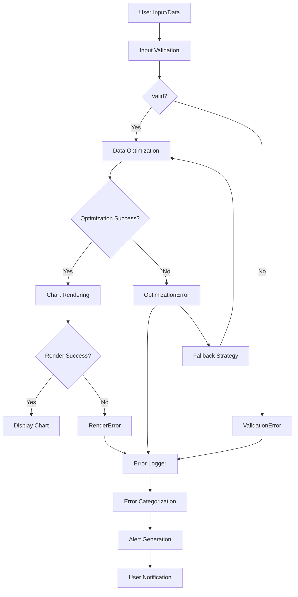

# PNL Chart Error Handling Documentation

## Table of Contents
1. [Overview and Architecture](#overview-and-architecture)
2. [Error Scenarios and Handling Strategies](#error-scenarios-and-handling-strategies)
3. [Component-Specific Error Handling](#component-specific-error-handling)
4. [Monitoring and Alerting](#monitoring-and-alerting)
5. [Recovery Mechanisms](#recovery-mechanisms)
6. [Developer Guidelines](#developer-guidelines)
7. [User Experience Considerations](#user-experience-considerations)
8. [Configuration and Customization](#configuration-and-customization)

---

## Overview and Architecture

### Error Handling System Architecture

The PNL chart system implements a multi-layered error handling architecture designed to provide robust, user-friendly error management while maintaining system stability and performance.

```
┌─────────────────────────────────────────────────────────────────┐
│                    Error Handling Layers                      │
├─────────────────────────────────────────────────────────────────┤
│ 1. Component Level (Error Boundaries)                        │
│    - ChartErrorBoundary                                        │
│    - ErrorBoundaryWrapper                                      │
│    - Component-level validation                                 │
├─────────────────────────────────────────────────────────────────┤
│ 2. Data Processing Level                                      │
│    - ChartDataOptimizer                                       │
│    - Input validation                                        │
│    - Fallback strategies                                     │
├─────────────────────────────────────────────────────────────────┤
│ 3. Network/API Level                                         │
│    - Retry with exponential backoff                           │
│    - Connection timeout handling                              │
│    - API response validation                                 │
├─────────────────────────────────────────────────────────────────┤
│ 4. Monitoring & Alerting Level                               │
│    - ChartMonitoring                                         │
│    - ChartAlerting                                          │
│    - ChartErrorLogger                                       │
├─────────────────────────────────────────────────────────────────┤
│ 5. User Experience Level                                     │
│    - Toast notifications                                     │
│    - Loading states                                        │
│    - Graceful degradation                                   │
└─────────────────────────────────────────────────────────────────┘
```

### Component Responsibilities and Interactions

#### Core Components

1. **PnlChart Component** ([`src/components/Charts.tsx`](src/components/Charts.tsx:64))
   - Primary chart rendering component
   - Integrates optimization, monitoring, and error handling
   - Provides retry mechanisms and fallback states

2. **ChartDataOptimizer** ([`src/utils/chartDataOptimizer.ts`](src/utils/chartDataOptimizer.ts:90))
   - Handles data optimization and validation
   - Implements multiple fallback strategies
   - Provides performance metrics and error logging

3. **ChartErrorBoundary** ([`src/components/ChartErrorBoundary.tsx`](src/components/ChartErrorBoundary.tsx:22))
   - React error boundary for chart components
   - Catches render-time errors and provides recovery options
   - Maintains error history and statistics

4. **ChartMonitoring** ([`src/utils/chartMonitoring.ts`](src/utils/chartMonitoring.ts:68))
   - Real-time performance monitoring
   - Memory usage tracking and trend analysis
   - Automated alert generation based on thresholds

5. **ChartAlerting** ([`src/utils/chartAlerting.ts`](src/utils/chartAlerting.ts:63))
   - Configurable alert rules and preferences
   - User notification management
   - Alert history and acknowledgment system

6. **ChartErrorLogger** ([`src/utils/chartErrorLogger.ts`](src/utils/chartErrorLogger.ts:58))
   - Centralized error logging and analytics
   - Error categorization and severity assessment
   - Remote logging and persistence

### Data Flow and Error Propagation



### Monitoring and Alerting Integration

The system provides real-time monitoring through multiple channels:

- **Performance Monitoring**: Tracks processing time, memory usage, and data size
- **Error Tracking**: Monitors error rates, types, and trends
- **User Experience Metrics**: Measures loading states, retry attempts, and user interactions
- **Alert System**: Configurable notifications for different severity levels

---

## Error Scenarios and Handling Strategies

### Data Validation Errors

#### Null/Undefined Data Handling

**Scenario**: Chart receives null, undefined, or empty data

**Detection**: 
```typescript
// From ChartDataOptimizer.validateInput()
if (trades === null || trades === undefined) {
  errors.push('Input trades data is null or undefined');
  return { isValid: false, errors };
}
```

**Handling Strategy**:
1. **Immediate Fallback**: Return safe default chart data
2. **User Notification**: Display "No Data" state with helpful message
3. **Error Logging**: Record validation failure for monitoring

**Implementation**:
```typescript
// Safe default data creation
private createSafeDefaultData(
  trades: TradeData[] | null | undefined,
  reason: string,
  config: OptimizationConfig,
  errors: string[],
  warnings: string[]
): OptimizedChartData {
  return {
    data: [0],
    labels: ['No Data'],
    originalDataPoints: trades?.length || 0,
    optimizedDataPoints: 1,
    compressionRatio: 0,
    processingTime: 0,
    strategy: 'emergency-fallback',
    warnings,
    errors
  };
}
```

#### Invalid Data Structures

**Scenario**: Trade objects missing required fields or containing invalid values

**Detection**:
```typescript
// Field validation in ChartDataOptimizer
for (let i = 0; i < trades.length; i++) {
  const trade = trades[i];
  
  if (!trade || typeof trade !== 'object') {
    errors.push(`Trade at index ${i} is not a valid object`);
    continue;
  }

  // Check for required fields
  if (!trade.id && !trade.date && !trade.trade_date) {
    errors.push(`Trade at index ${i} lacks identification`);
  }

  // Check for valid PnL/return values
  const pnl = trade.pnl || trade.return;
  if (pnl !== undefined && (typeof pnl !== 'number' || isNaN(pnl))) {
    errors.push(`Trade at index ${i} has invalid PnL/return value: ${pnl}`);
  }
}
```

**Handling Strategy**:
1. **Data Sanitization**: Attempt to clean and repair data
2. **Partial Rendering**: Display valid trades while noting issues
3. **User Guidance**: Provide specific feedback about data problems

### Performance Issues

#### Slow Processing

**Scenario**: Chart processing takes longer than acceptable thresholds

**Detection**:
```typescript
// Performance thresholds in ChartMonitoring
const thresholds = {
  slowProcessingWarning: 100, // 100ms
  slowProcessingCritical: 500, // 500ms
  optimizationTimeWarning: 50, // 50ms
  optimizationTimeCritical: 200, // 200ms
};
```

**Handling Strategy**:
1. **Progressive Optimization**: Switch to more aggressive optimization
2. **User Feedback**: Show loading indicators with progress
3. **Performance Alerts**: Notify users of delays

**Implementation**:
```typescript
// Adaptive strategy selection
if (trades.length >= 10000) {
  const warning = `Extreme dataset detected: ${trades.length} trades. Performance may be impacted.`;
  warnings.push(warning);
  
  // Switch to faster strategy for extreme datasets
  if (finalConfig.strategy !== 'equal-interval') {
    finalConfig.strategy = 'equal-interval';
  }
}
```

#### Memory Limit Exceeded

**Scenario**: Chart processing exceeds available memory

**Detection**:
```typescript
// Memory monitoring in ChartDataOptimizer
const memoryBefore = this.getMemoryUsage();
const memoryAfter = this.getMemoryUsage();
const memoryUsed = memoryAfter - memoryBefore;

if (finalConfig.memoryThreshold && memoryUsed > finalConfig.memoryThreshold) {
  const memoryWarning = `High memory usage detected: ${memoryUsed.toFixed(2)}MB`;
  warnings.push(memoryWarning);
}
```

**Handling Strategy**:
1. **Memory Cleanup**: Force garbage collection where possible
2. **Data Reduction**: Implement more aggressive sampling
3. **Fallback Rendering**: Use simplified chart representation

### Network Failures

#### Timeouts and Connection Issues

**Scenario**: API calls fail due to network issues

**Detection**:
```typescript
// Network error categorization in ChartErrorLogger
private categorizeError(error: Error): ChartErrorLog['errorType'] {
  const message = error.message.toLowerCase();
  
  if (message.includes('network') || message.includes('fetch')) {
    return 'network';
  }
  // ... other categories
}
```

**Handling Strategy**:
1. **Exponential Backoff Retry**: Implement smart retry mechanism
2. **Offline Mode**: Use cached data when available
3. **User Notification**: Clear messaging about connectivity issues

**Implementation**:
```typescript
// Retry configuration from useRetryWithBackoff
const RETRY_PRESETS = {
  NETWORK: {
    maxRetries: 5,
    baseDelay: 2000,
    maxDelay: 60000,
    backoffFactor: 2,
    jitter: true
  }
};
```

### Rendering Errors

#### Chart Library Failures

**Scenario**: Chart.js rendering fails or throws exceptions

**Detection**: 
```typescript
// Error boundary in ChartErrorBoundary
componentDidCatch(error: Error, errorInfo: React.ErrorInfo) {
  this.setState({
    error,
    errorInfo
  });

  // Log error for debugging
  this.logError(error, errorInfo);
}
```

**Handling Strategy**:
1. **Error Boundary**: Catch render errors and provide fallback UI
2. **Chart Library Fallback**: Switch to alternative rendering method
3. **User Recovery**: Offer retry and refresh options

### Extreme Dataset Handling

#### Large Dataset Scenarios

**Scenario**: Charts with 0, 1, 10, 1000, 10000+ trades

**Handling Strategy by Size**:

| Dataset Size | Strategy | Optimization | Fallback |
|-------------|----------|---------------|------------|
| 0 trades | Empty State | N/A | "No Data" display |
| 1 trade | Direct Render | None | Single point chart |
| 10 trades | Direct Render | None | Original data |
| 1000 trades | Adaptive Sampling | LTTB/Equal Interval | Safe sampling |
| 10000+ trades | Emergency Mode | Equal Interval + Aggressive | Simplified chart |

**Implementation**:
```typescript
// Cold start logic: return as-is if ≤ 10 trades
if (trades.length <= 10) {
  const processingTime = performance.now() - startTime;
  const processedData = this.processTradesForChart(trades);
  
  return {
    ...processedData,
    originalDataPoints: trades.length,
    optimizedDataPoints: trades.length,
    compressionRatio: 1,
    processingTime,
    strategy: 'none'
  };
}
```

---

## Component-Specific Error Handling

### chartDataOptimizer Error Handling Strategies

The ChartDataOptimizer implements comprehensive error handling with multiple fallback layers:

#### Multi-Level Validation

```typescript
public optimizeTrades(trades: TradeData[], config: Partial<OptimizationConfig> = {}): OptimizedChartData {
  // Level 1: Input validation
  const validationResult = this.validateInput(trades);
  if (!validationResult.isValid) {
    return this.createSafeDefaultData(trades, 'invalid-input', finalConfig, errors, warnings);
  }

  // Level 2: Memory check
  const memoryBefore = this.getMemoryUsage();
  if (memoryBefore > finalConfig.memoryThreshold) {
    warnings.push(`High initial memory usage: ${memoryBefore.toFixed(2)}MB`);
  }

  // Level 3: Strategy execution with fallback
  try {
    sampledTrades = this.executeOptimizationStrategy(trades, finalConfig);
  } catch (error) {
    // Try fallback strategy
    if (finalConfig.fallbackStrategy) {
      try {
        sampledTrades = this.executeOptimizationStrategy(trades, { 
          ...finalConfig, 
          strategy: finalConfig.fallbackStrategy 
        });
      } catch (fallbackError) {
        return this.createSafeDefaultData(trades, 'optimization-failed', finalConfig, errors, warnings);
      }
    }
  }
}
```

#### Strategy-Specific Error Handling

Each optimization strategy includes error handling:

1. **Equal Interval Sampling**: Safe array access with bounds checking
2. **Adaptive Sampling**: Volatility calculation with error bounds
3. **LTTB Algorithm**: Triangle area calculation with validation
4. **Min-Max Sampling**: Window processing with error recovery

#### Performance Monitoring Integration

```typescript
// Integrated performance tracking
const processingTime = performance.now() - startTime;
const performanceMetrics = this.createPerformanceMetrics(
  originalTrades, 
  optimizedTrades, 
  processingTime, 
  strategyUsed, 
  memoryBefore, 
  memoryAfter
);

return {
  ...result,
  performanceMetrics
};
```

### PnlChart Component Error Boundaries

#### Multi-Layer Error Protection

```typescript
export const PnlChart = ({ trades, enableOptimization, onError, ...props }) => {
  // Layer 1: Retry mechanism with backoff
  const {
    data: retryData,
    error: retryError,
    manualRetry
  } = useRetryWithBackoff(processTradesWithRetry, RETRY_PRESETS.DATA_PROCESSING);

  // Layer 2: Error boundary wrapper
  return (
    <ChartErrorBoundary
      chartName="PnL Chart"
      onError={(boundaryError, errorInfo) => {
        chartErrorLogger.logError(boundaryError, 'pnl-chart', {
          component: 'PnlChart-ErrorBoundary',
          errorInfo: errorInfo?.componentStack
        });
        onError?.(boundaryError);
      }}
      onRetry={manualRetry}
      showRetry={true}
    >
      {/* Chart content */}
    </ChartErrorBoundary>
  );
};
```

#### State Management for Error Handling

```typescript
const [optimizedData, setOptimizedData] = useState<OptimizedChartData | null>(null);
const [error, setError] = useState<Error | null>(null);
const [isEmpty, setIsEmpty] = useState(false);

// Error state handling
useEffect(() => {
  if (retryError) {
    setError(retryError);
    onError?.(retryError);
    
    // Log error for monitoring
    chartErrorLogger.logError(retryError, 'pnl-chart', {
      component: 'PnlChart',
      dataSize: memoizedTrades.length,
      retryCount: retryState.attemptCount
    });
  }
}, [retryError]);
```

### Dashboard Error Handling Integration

#### Global Error Context

The Dashboard integrates with the chart error handling system through:

```typescript
// Dashboard error state management
const [dashboardError, setDashboardError] = useState<Error | null>(null);

// Enhanced data fetching with retry mechanism
const fetchDashboardData = async () => {
  try {
    // Data fetching logic
  } catch (error) {
    const err = error instanceof Error ? error : new Error('Failed to load dashboard data');
    setDashboardError(err);
    setError(err.message);
  }
};

const { manualRetry } = useRetryWithBackoff(fetchDashboardData, RETRY_PRESETS.NETWORK);
```

#### Error Recovery UI

```typescript
// Error display with recovery options
{error && stats && (
  <ChartErrorState
    error={error}
    onRetry={manualRetry}
    onDismiss={() => setError(null)}
    showDetails={showDebugInfo}
    chartType="Dashboard"
    retryCount={retryCount}
    maxRetries={3}
  />
)}
```

### Test Page Error Simulation Capabilities

The test pages provide comprehensive error simulation:

#### Error Scenario Testing

```typescript
// Test scenarios for error handling
const errorScenarios = {
  'null-data': () => setTestData(null),
  'invalid-structure': () => setTestData([{ invalid: 'data' }]),
  'extreme-dataset': () => setTestData(generateLargeDataset(10000)),
  'memory-pressure': () => setTestData(generateMemoryIntensiveData()),
  'network-failure': () => simulateNetworkFailure(),
  'rendering-error': () => simulateRenderingError()
};
```

#### Debug Information Display

```typescript
// Debug overlay for error testing
{showDebugInfo && retryState && (
  <div className="absolute bottom-2 left-2 bg-black/70 text-white text-xs p-2 rounded">
    <div>Retry State:</div>
    <div>Is Retrying: {retryState.isRetrying ? 'Yes' : 'No'}</div>
    <div>Attempts: {retryState.attemptCount}</div>
    <div>Can Retry: {retryState.canRetry ? 'Yes' : 'No'}</div>
    {retryState.nextRetryIn && (
      <div>Next Retry In: {Math.round(retryState.nextRetryIn / 1000)}s</div>
    )}
  </div>
)}
```

---

## Monitoring and Alerting

### Performance Monitoring Thresholds

#### Default Thresholds

```typescript
const defaultThresholds = {
  slowProcessingWarning: 100,    // 100ms
  slowProcessingCritical: 500,   // 500ms
  memoryUsageWarning: 50,       // 50MB
  memoryUsageCritical: 100,      // 100MB
  errorRateWarning: 10,         // 10 errors per 1000 renders
  errorRateCritical: 50,        // 50 errors per 1000 renders
  optimizationTimeWarning: 50,    // 50ms
  optimizationTimeCritical: 200   // 200ms
};
```

#### Dynamic Threshold Adjustment

```typescript
// Performance-based threshold adjustment
const adjustThresholds = (performanceLevel: string) => {
  const multiplier = performanceLevel === 'excellent' ? 0.8 : 
                    performanceLevel === 'good' ? 1.0 :
                    performanceLevel === 'warning' ? 1.2 : 1.5;

  return {
    slowProcessingWarning: 100 * multiplier,
    slowProcessingCritical: 500 * multiplier,
    memoryUsageWarning: 50 * multiplier,
    memoryUsageCritical: 100 * multiplier
  };
};
```

### Memory Usage Tracking

#### Real-Time Memory Monitoring

```typescript
// Memory usage calculation
private getMemoryUsage(): number {
  if (typeof performance !== 'undefined' && (performance as any).memory) {
    return (performance as any).memory.usedJSHeapSize / 1024 / 1024; // MB
  }
  return 0;
}

// Memory trend analysis
private calculateMemoryTrend(memoryHistory: number[]): 'increasing' | 'decreasing' | 'stable' {
  if (memoryHistory.length < 3) return 'stable';
  
  const recent = memoryHistory.slice(-3);
  const trend = recent[2] - recent[0];
  const threshold = Math.abs(recent[0]) * 0.1; // 10% threshold
  
  if (Math.abs(trend) < threshold) return 'stable';
  return trend > 0 ? 'increasing' : 'decreasing';
}
```

#### Memory Leak Detection

```typescript
// Memory leak detection in ChartMonitoring
private checkMemoryLeaks(): void {
  const currentMemory = this.getMemoryUsage();
  const baselineMemory = this.getBaselineMemory();
  const memoryIncrease = currentMemory - baselineMemory;
  
  if (memoryIncrease > 20) { // 20MB increase indicates potential leak
    this.createAlert(
      'memory',
      'critical',
      `Potential memory leak detected: ${memoryIncrease.toFixed(1)}MB increase`,
      'system'
    );
  }
}
```

### Error Rate Calculations

#### Error Rate Metrics

```typescript
// Error rate calculation
private calculateErrorRate(): number {
  const totalRenders = this.chartRenderCount;
  const totalErrors = this.metrics.totalErrors;
  
  return totalRenders > 0 ? (totalErrors / totalRenders) * 1000 : 0;
}

// Error trend analysis
private calculateErrorTrend(): 'increasing' | 'decreasing' | 'stable' {
  const recentErrors = this.getRecentErrorCounts();
  if (recentErrors.length < 3) return 'stable';
  
  const trend = recentErrors[2] - recentErrors[0];
  const threshold = Math.abs(recentErrors[0]) * 0.2; // 20% threshold
  
  if (Math.abs(trend) < threshold) return 'stable';
  return trend > 0 ? 'increasing' : 'decreasing';
}
```

#### Error Classification

```typescript
// Error categorization in ChartErrorLogger
private categorizeError(error: Error): ChartErrorLog['errorType'] {
  const message = error.message.toLowerCase();
  
  if (message.includes('render') || message.includes('display')) {
    return 'render';
  }
  if (message.includes('network') || message.includes('fetch')) {
    return 'network';
  }
  if (message.includes('memory') || message.includes('heap')) {
    return 'memory';
  }
  if (message.includes('data') || message.includes('optimization')) {
    return 'data';
  }
  if (message.includes('optimization') || message.includes('sampling')) {
    return 'optimization';
  }
  
  return 'unknown';
}
```

### Alert Severity Levels and Responses

#### Severity Classification

```typescript
// Severity determination in ChartErrorLogger
private determineSeverity(error: Error, errorType: ChartErrorLog['errorType']): ChartErrorLog['severity'] {
  const message = error.message.toLowerCase();
  
  // Critical errors
  if (message.includes('maximum update depth') || 
      message.includes('stack overflow') || 
      message.includes('out of memory')) {
    return 'critical';
  }
  
  // High severity
  if (errorType === 'memory' || 
      message.includes('crash') || 
      message.includes('fatal')) {
    return 'high';
  }
  
  // Medium severity
  if (errorType === 'network' || 
      errorType === 'optimization' || 
      message.includes('failed')) {
    return 'medium';
  }
  
  // Low severity
  return 'low';
}
```

#### Alert Response Strategies

| Severity | Response | User Notification | Auto-Recovery |
|----------|----------|-------------------|----------------|
| Critical | Immediate alert, stop processing | Toast + Desktop notification | Attempt graceful degradation |
| High | Alert with retry options | Toast with sound | Fallback strategy activation |
| Medium | Warning with optional retry | Toast notification | Continue with monitoring |
| Low | Informational only | Small toast | Log only |

#### Alert Cooldown and Throttling

```typescript
// Alert throttling in ChartMonitoring
private shouldThrottleAlert(type: string, message: string): boolean {
  const key = `${type}_${message}`;
  const lastAlert = this.lastAlertTimes.get(key);
  
  if (lastAlert) {
    const timeSinceLastAlert = Date.now() - lastAlert.getTime();
    return timeSinceLastAlert < this.config.alertCooldown;
  }
  
  return false;
}
```

---

## Recovery Mechanisms

### Retry Strategies with Exponential Backoff

#### Configurable Retry Presets

```typescript
// Retry presets for different scenarios
export const RETRY_PRESETS = {
  // For network operations that might fail temporarily
  NETWORK: {
    maxRetries: 5,
    baseDelay: 2000,
    maxDelay: 60000,
    backoffFactor: 2,
    jitter: true
  },

  // For data processing operations
  DATA_PROCESSING: {
    maxRetries: 2,
    baseDelay: 500,
    maxDelay: 5000,
    backoffFactor: 1.5,
    jitter: false
  },

  // For chart rendering operations
  CHART_RENDERING: {
    maxRetries: 3,
    baseDelay: 1000,
    maxDelay: 10000,
    backoffFactor: 2,
    jitter: true
  }
};
```

#### Exponential Backoff Implementation

```typescript
// Backoff calculation with jitter
const calculateDelay = (attempt: number): number => {
  let delay = baseDelay * Math.pow(backoffFactor, attempt - 1);
  
  // Apply maximum delay limit
  delay = Math.min(delay, maxDelay);
  
  // Add jitter to prevent thundering herd
  if (jitter) {
    const jitterRange = delay * 0.1; // 10% jitter
    delay = delay + (Math.random() - 0.5) * jitterRange;
  }
  
  return Math.max(0, Math.floor(delay));
};
```

#### Retry State Management

```typescript
// Retry state tracking
interface RetryState {
  isRetrying: boolean;
  attemptCount: number;
  lastError: Error | null;
  canRetry: boolean;
  nextRetryIn: number | null;
}

// Retry execution with state management
const executeOperation = async (attemptNumber: number = 1): Promise<T | null> => {
  try {
    const result = await operation();
    
    // Success - reset retry state
    setRetryState({
      isRetrying: false,
      lastError: null,
      canRetry: false,
      nextRetryIn: null
    });
    
    return result;
  } catch (err) {
    const error = err instanceof Error ? err : new Error('Unknown error');
    
    // Determine if we should retry
    const shouldRetry = attemptNumber < maxRetries;
    
    if (shouldRetry) {
      const delay = calculateDelay(attemptNumber);
      
      // Schedule automatic retry
      setTimeout(() => {
        executeOperation(attemptNumber + 1);
      }, delay);
    }
    
    return null;
  }
};
```

### Fallback Data Processing

#### Multi-Level Fallback Strategy

```typescript
// Fallback strategy hierarchy in ChartDataOptimizer
public optimizeTrades(trades: TradeData[], config: Partial<OptimizationConfig> = {}): OptimizedChartData {
  try {
    // Primary strategy
    return this.executeOptimizationStrategy(trades, finalConfig);
  } catch (primaryError) {
    try {
      // Fallback strategy
      return this.executeOptimizationStrategy(trades, { 
        ...finalConfig, 
        strategy: finalConfig.fallbackStrategy 
      });
    } catch (fallbackError) {
      // Emergency fallback
      return this.createSafeDefaultData(trades, 'optimization-failed', finalConfig, errors, warnings);
    }
  }
}
```

#### Safe Default Data Creation

```typescript
// Emergency fallback data
private createSafeDefaultData(
  trades: TradeData[] | null | undefined,
  reason: string,
  config: OptimizationConfig,
  errors: string[],
  warnings: string[]
): OptimizedChartData {
  // Try to use original data if available
  if (trades && Array.isArray(trades) && trades.length > 0) {
    try {
      // For large datasets, sample them simply
      let safeTrades = trades;
      if (trades.length > 100) {
        const step = Math.ceil(trades.length / 100);
        safeTrades = trades.filter((_, index) => index % step === 0);
      }
      
      const processedData = this.processTradesForChart(safeTrades);
      return {
        ...processedData,
        strategy: 'safe-fallback',
        warnings: [...warnings, `Using safe fallback data due to: ${reason}`],
        errors
      };
    } catch (error) {
      // Ultimate fallback
    }
  }
  
  // Ultimate fallback - return empty chart data
  return {
    data: [0],
    labels: ['No Data'],
    originalDataPoints: trades?.length || 0,
    optimizedDataPoints: 1,
    compressionRatio: 0,
    processingTime: 0,
    strategy: 'emergency-fallback',
    warnings,
    errors
  };
}
```

### Graceful Degradation Approaches

#### Performance-Based Degradation

```typescript
// Adaptive quality based on performance
const adaptQuality = (performanceLevel: string) => {
  switch (performanceLevel) {
    case 'excellent':
      return {
        targetPoints: 50,
        strategy: 'lttb',
        enableAnimations: true,
        enableTransitions: true
      };
    case 'good':
      return {
        targetPoints: 30,
        strategy: 'adaptive',
        enableAnimations: true,
        enableTransitions: false
      };
    case 'warning':
      return {
        targetPoints: 20,
        strategy: 'equal-interval',
        enableAnimations: false,
        enableTransitions: false
      };
    case 'critical':
      return {
        targetPoints: 10,
        strategy: 'minmax',
        enableAnimations: false,
        enableTransitions: false
      };
  }
};
```

#### Feature Toggling

```typescript
// Feature disabling for performance
const disableFeatures = (memoryUsage: number) => {
  const features = {
    animations: memoryUsage < 50,
    tooltips: memoryUsage < 75,
    legends: memoryUsage < 100,
    gridLines: memoryUsage < 125
  };
  
  return features;
};
```

### User Recovery Options

#### Interactive Error Recovery

```typescript
// Error recovery UI component
const ErrorRecoveryOptions = ({ error, onRetry, onFallback, onDismiss }) => (
  <div className="error-recovery-options">
    <h3>Chart Error Recovery</h3>
    <p>{error.message}</p>
    
    <div className="recovery-actions">
      <button onClick={onRetry}>
        Retry ({retryCount} of {maxRetries})
      </button>
      
      <button onClick={onFallback}>
        Use Simplified Chart
      </button>
      
      <button onClick={onDismiss}>
        Dismiss
      </button>
    </div>
    
    {showDetails && (
      <details>
        <summary>Technical Details</summary>
        <pre>{error.stack}</pre>
      </details>
    )}
  </div>
);
```

#### Manual Override Options

```typescript
// Manual configuration override
const ManualOverride = ({ onOverride }) => (
  <div className="manual-override">
    <h4>Manual Configuration</h4>
    
    <label>
      Optimization Strategy:
      <select onChange={(e) => onOverride('strategy', e.target.value)}>
        <option value="equal-interval">Equal Interval</option>
        <option value="adaptive">Adaptive</option>
        <option value="lttb">LTTB</option>
        <option value="minmax">Min-Max</option>
        <option value="none">No Optimization</option>
      </select>
    </label>
    
    <label>
      Target Points:
      <input 
        type="number" 
        min="5" 
        max="100" 
        onChange={(e) => onOverride('targetPoints', parseInt(e.target.value))}
      />
    </label>
    
    <label>
      Enable Monitoring:
      <input 
        type="checkbox" 
        onChange={(e) => onOverride('monitoring', e.target.checked)}
      />
    </label>
  </div>
);
```

---

## Developer Guidelines

### How to Add New Error Handling

#### 1. Define Error Type

```typescript
// Add new error type to ChartErrorLog['errorType']
export interface ChartErrorLog {
  errorType: 'render' | 'data' | 'optimization' | 'network' | 'memory' | 'validation' | 'unknown';
}
```

#### 2. Implement Error Detection

```typescript
// Add detection logic to categorizeError method
private categorizeError(error: Error): ChartErrorLog['errorType'] {
  const message = error.message.toLowerCase();
  
  // Add new error type detection
  if (message.includes('validation') || message.includes('schema')) {
    return 'validation';
  }
  
  // ... existing logic
}
```

#### 3. Create Handling Strategy

```typescript
// Implement specific handling for new error type
private handleValidationError(error: Error, context: any): OptimizedChartData {
  // Validation-specific error handling
  const validationErrors = this.extractValidationErrors(error);
  const sanitizedData = this.sanitizeData(context.trades, validationErrors);
  
  return {
    ...this.processTradesForChart(sanitizedData),
    strategy: 'validation-fallback',
    warnings: [`Data validation issues detected: ${validationErrors.length} errors`],
    errors: [error.message]
  };
}
```

#### 4. Add Alert Rule

```typescript
// Add alert rule for new error type
const validationAlertRule: AlertRule = {
  id: 'validation-error',
  name: 'Validation Error',
  description: 'Alert when data validation fails',
  type: 'error',
  severity: 'warning',
  condition: (metrics) => metrics.errors.recentValidationErrors > 0,
  message: (metrics) => `Data validation failed: ${metrics.errors.recentValidationErrors} errors`,
  enabled: true,
  cooldown: 30000,
  category: 'data'
};
```

### Best Practices for Error Scenarios

#### Error Handling Principles

1. **Fail Fast, Fail Gracefully**
   ```typescript
   // Validate early and return clear errors
   if (!trades || trades.length === 0) {
     return {
       data: [0],
       labels: ['No Data'],
       strategy: 'empty-data'
     };
   }
   ```

2. **Provide Contextual Information**
   ```typescript
   // Include relevant context in errors
   chartErrorLogger.logError(error, 'pnl-chart', {
     component: 'ChartDataOptimizer',
     dataSize: trades.length,
     retryCount: attemptCount,
     processingTime: processingTime,
     memoryUsage: memoryUsage
   });
   ```

3. **Implement Progressive Fallbacks**
   ```typescript
   // Multiple levels of fallback
   try {
     return primaryStrategy();
   } catch (primaryError) {
     try {
       return fallbackStrategy();
     } catch (fallbackError) {
       return emergencyFallback();
     }
   }
   ```

4. **Monitor and Log Everything**
   ```typescript
   // Comprehensive logging
   this.log('info', 'Starting optimization', {
     tradesCount: trades.length,
     config: finalConfig
   });
   ```

#### Error Message Guidelines

1. **Be Specific and Actionable**
   ```typescript
   // Good: Specific with suggested action
   "Chart processing failed due to invalid date format. Please check your data format."
   
   // Bad: Generic
   "Chart error occurred"
   ```

2. **Include Technical Details for Developers**
   ```typescript
   // Include error context for debugging
   const errorContext = {
     component: 'PnlChart',
     props: { tradesCount: trades.length, enableOptimization },
     stackTrace: error.stack,
     userAgent: navigator.userAgent
   };
   ```

3. **Provide Recovery Options**
   ```typescript
   // Always offer a path forward
   const recoveryOptions = {
     retry: true,
     fallback: true,
     contactSupport: error.severity === 'critical'
   };
   ```

### Testing Error Conditions

#### Unit Testing Error Scenarios

```typescript
// Test error handling
describe('ChartDataOptimizer Error Handling', () => {
  test('should handle null data gracefully', () => {
    const result = optimizer.optimizeTrades(null);
    
    expect(result.strategy).toBe('emergency-fallback');
    expect(result.data).toEqual([0]);
    expect(result.labels).toEqual(['No Data']);
    expect(result.errors).toContain('Input trades data is null or undefined');
  });

  test('should handle invalid data structure', () => {
    const invalidTrades = [{ invalid: 'data' }];
    const result = optimizer.optimizeTrades(invalidTrades);
    
    expect(result.strategy).toBe('safe-fallback');
    expect(result.warnings).toHaveLength(1);
  });

  test('should handle optimization failure', () => {
    // Mock strategy to throw error
    jest.spyOn(optimizer, 'executeOptimizationStrategy').mockImplementation(() => {
      throw new Error('Optimization failed');
    });
    
    const result = optimizer.optimizeTrades(validTrades);
    
    expect(result.strategy).toBe('safe-fallback');
  });
});
```

#### Integration Testing Error Recovery

```typescript
// Test error recovery in components
describe('PnlChart Error Recovery', () => {
  test('should retry on optimization failure', async () => {
    const { rerender } = render(<PnlChart trades={invalidTrades} />);
    
    // Wait for retry attempt
    await waitFor(() => {
      expect(screen.getByText('Retrying...')).toBeInTheDocument();
    });
    
    // Verify retry button is present
    expect(screen.getByText('Try Again')).toBeInTheDocument();
  });

  test('should show fallback on persistent failure', async () => {
    const { rerender } = render(<PnlChart trades={invalidTrades} />);
    
    // Wait for all retries to exhaust
    await waitFor(() => {
      expect(screen.getByText('Using simplified chart')).toBeInTheDocument();
    });
  });
});
```

#### Error Simulation for Testing

```typescript
// Error simulation utilities
export const simulateErrors = {
  networkFailure: () => {
    global.fetch = jest.fn(() => Promise.reject(new Error('Network error')));
  },
  
  memoryPressure: () => {
    Object.defineProperty(performance, 'memory', {
      value: {
        usedJSHeapSize: 500 * 1024 * 1024 // 500MB
      }
    });
  },
  
  renderingError: () => {
    // Mock Chart.js to throw error
    jest.spyOn(Chart, 'register').mockImplementation(() => {
      throw new Error('Rendering failed');
    });
  },
  
  dataCorruption: (trades: TradeData[]) => {
    return trades.map(trade => ({
      ...trade,
      pnl: NaN,
      date: 'invalid-date'
    }));
  }
};
```

### Debugging and Troubleshooting

#### Debug Mode Configuration

```typescript
// Enable debug mode
const debugConfig = {
  enableLogging: true,
  enableMetrics: true,
  enableDetailedErrors: true,
  logLevel: 'debug'
};

// Debug component
const DebugPanel = () => {
  const [logs, setLogs] = useState([]);
  const [metrics, setMetrics] = useState(null);
  
  useEffect(() => {
    // Subscribe to debug events
    const unsubscribe = chartErrorLogger.subscribeToMetrics((newMetrics) => {
      setMetrics(newMetrics);
    });
    
    return unsubscribe;
  }, []);
  
  return (
    <div className="debug-panel">
      <h3>Debug Information</h3>
      
      <div className="metrics">
        <h4>Performance Metrics</h4>
        <pre>{JSON.stringify(metrics, null, 2)}</pre>
      </div>
      
      <div className="logs">
        <h4>Error Logs</h4>
        <pre>{JSON.stringify(logs, null, 2)}</pre>
      </div>
    </div>
  );
};
```

#### Troubleshooting Checklist

1. **Data Issues**
   - [ ] Verify data structure matches expected schema
   - [ ] Check for null/undefined values
   - [ ] Validate date formats
   - [ ] Ensure numeric fields are valid numbers

2. **Performance Issues**
   - [ ] Monitor memory usage trends
   - [ ] Check processing time metrics
   - [ ] Verify optimization strategy effectiveness
   - [ ] Review dataset size impact

3. **Network Issues**
   - [ ] Verify API endpoint accessibility
   - [ ] Check timeout configurations
   - [ ] Review retry mechanism effectiveness
   - [ ] Test offline behavior

4. **Rendering Issues**
   - [ ] Verify Chart.js compatibility
   - [ ] Check browser console for errors
   - [ ] Test with different data sizes
   - [ ] Verify responsive behavior

#### Error Analysis Tools

```typescript
// Error analysis utility
export const analyzeErrors = (errorLogs: ChartErrorLog[]) => {
  const analysis = {
    totalErrors: errorLogs.length,
    errorsByType: {},
    errorsBySeverity: {},
