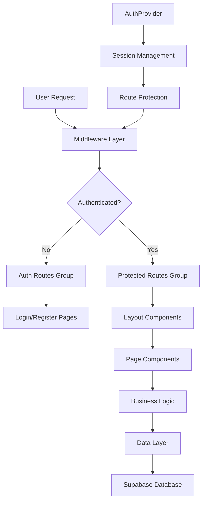
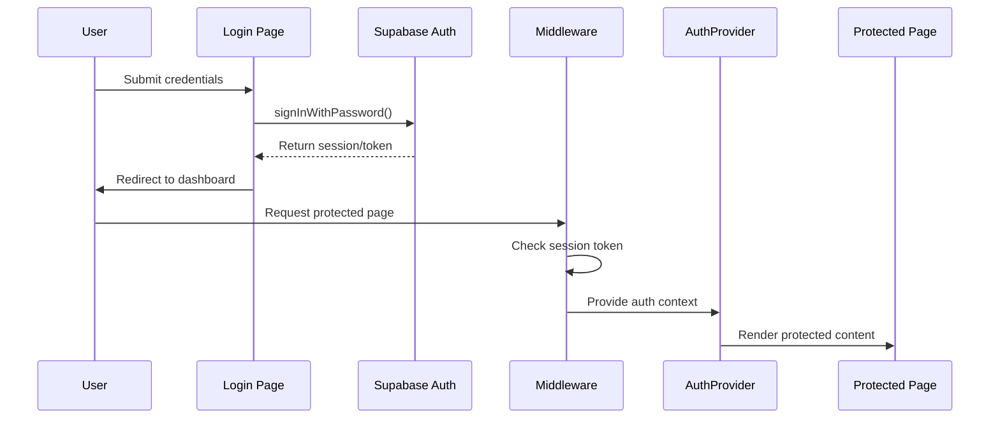
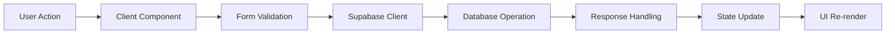

# VeroTrade Trading Journal - Architecture Overview

## Executive Summary

This document provides a comprehensive overview of the VeroTrade trading journal application's final architecture following the complete reconstruction project. The architecture follows Next.js 14 best practices with proper separation of concerns, security measures, and scalable design patterns.

## Technology Stack

### Core Framework
- **Next.js 14.2.5** with App Router
- **React 18.3.1** with TypeScript support
- **Tailwind CSS 3.4.10** for styling
- **Supabase** for database and authentication

### Key Dependencies
```json
{
  "dependencies": {
    "@supabase/supabase-js": "^2.45.0",
    "date-fns": "^3.6.0",
    "lucide-react": "^0.447.0",
    "react": "^18.3.1",
    "react-dom": "^18.3.1",
    "recharts": "^2.12.7"
  }
}
```

## Application Architecture

### High-Level Architecture



### Route Architecture

The application uses Next.js 14 App Router with proper route grouping:

```
src/app/
├── (auth)/                    # Authentication route group
│   ├── layout.tsx            # Auth-specific layout
│   ├── login/
│   │   └── page.tsx          # Login page
│   └── register/
│       └── page.tsx          # Registration page
├── dashboard/                   # Main dashboard
│   ├── page.tsx                # Dashboard overview
│   └── loading.tsx             # Loading state
├── trades/                     # Trade management
│   ├── page.tsx                # Trade list
│   └── loading.tsx             # Loading state
├── log-trade/                  # Trade creation
│   ├── page.tsx                # Trade form
│   └── loading.tsx             # Loading state
├── analytics/                   # Analytics dashboard
│   ├── page.tsx                # Analytics page
│   └── loading.tsx             # Loading state
├── strategies/                  # Strategy management
│   ├── page.tsx                # Strategy list
│   ├── loading.tsx             # Loading state
│   └── create/
│       └── page.tsx            # Create strategy
├── calendar/                   # Trading calendar
│   └── page.tsx                # Calendar view
├── confluence/                  # Confluence analysis
│   └── page.tsx                # Confluence page
├── layout.tsx                  # Root layout
├── page.tsx                    # Home/landing page
└── globals.css                  # Global styles
```

### Route Protection Strategy

**Middleware Implementation:**
```typescript
// src/middleware.ts
export async function middleware(req: NextRequest) {
  const sessionToken = req.cookies.get('sb-access-token')?.value
  
  // Protected routes requiring authentication
  const protectedRoutes = ['/dashboard', '/trades', '/analytics', '/log-trade', '/strategies', '/calendar']
  
  // Auth routes that redirect authenticated users
  const authRoutes = ['/login', '/register']
  
  // Route protection logic
  if (!sessionToken && isProtectedRoute(req.nextUrl.pathname)) {
    return NextResponse.redirect(new URL('/login', req.url))
  }
  
  if (sessionToken && isAuthRoute(req.nextUrl.pathname)) {
    return NextResponse.redirect(new URL('/dashboard', req.url))
  }
}
```

## Component Architecture

### Component Hierarchy

```
src/components/
├── providers/                   # Context providers
│   └── AuthProvider.tsx         # Authentication context
├── layout/                     # Layout components
│   └── Sidebar.tsx              # Navigation sidebar
├── forms/                      # Form components
│   ├── TradeForm.tsx             # Trade creation form
│   ├── StrategyRuleCheckboxes.tsx # Strategy rule checkboxes
│   └── TradeModal.tsx            # Trade modal
├── ui/                         # Reusable UI components
│   ├── DashboardCard.tsx          # Dashboard stat cards
│   ├── PerformanceChart.tsx       # Performance charts
│   ├── EmotionRadar.tsx          # Emotional pattern radar
│   ├── StrategyCard.tsx           # Strategy display cards
│   └── ThemeToggle.tsx           # Theme toggle
└── common/                      # Common utilities
    └── ErrorBoundary.tsx           # Error boundary
```

### Design Patterns

#### 1. Provider Pattern
```typescript
// AuthProvider.tsx
interface AuthContextType {
  user: User | null;
  session: Session | null;
  loading: boolean;
  signOut: () => Promise<void>;
}

export const AuthContext = createContext<AuthContextType | undefined>(undefined);
```

#### 2. Composition Pattern
```typescript
// Dashboard layout composition
export default function DashboardLayout({ children }: { children: React.ReactNode }) {
  return (
    <div className="flex h-full">
      <Sidebar />
      <div className="flex-1 flex flex-col">
        <Header />
        <main className="flex-1 p-6 overflow-auto">
          {children}
        </main>
      </div>
    </div>
  );
}
```

#### 3. Error Boundary Pattern
```typescript
// ErrorBoundary.tsx
class ErrorBoundary extends Component<Props, State> {
  constructor(props: Props) {
    super(props);
    this.state = { hasError: false };
  }

  static getDerivedStateFromError(error: Error): State {
    return { hasError: true };
  }

  componentDidCatch(error: Error, errorInfo: ErrorInfo) {
    console.error('Error caught by boundary:', error, errorInfo);
  }
}
```

## Database Architecture

### Schema Design

The application uses a well-structured database schema with proper relationships and constraints:

#### Core Tables

**Trades Table:**
```sql
CREATE TABLE trades (
  id UUID DEFAULT gen_random_uuid() PRIMARY KEY,
  user_id UUID REFERENCES auth.users(id) ON DELETE CASCADE,
  market TEXT,
  symbol TEXT NOT NULL,
  strategy_id UUID REFERENCES strategies(id) ON DELETE SET NULL,
  trade_date DATE NOT NULL,
  side TEXT CHECK (side IN ('Buy', 'Sell')),
  quantity NUMERIC,
  entry_price NUMERIC,
  exit_price NUMERIC,
  pnl NUMERIC,
  entry_time TIME,
  exit_time TIME,
  emotional_state TEXT[],
  notes TEXT,
  rules_followed BOOLEAN[],
  created_at TIMESTAMP WITH TIME ZONE DEFAULT NOW(),
  updated_at TIMESTAMP WITH TIME ZONE DEFAULT NOW()
);
```

**Strategies Table:**
```sql
CREATE TABLE strategies (
  id UUID DEFAULT gen_random_uuid() PRIMARY KEY,
  user_id UUID REFERENCES auth.users(id) ON DELETE CASCADE,
  name TEXT NOT NULL,
  rules TEXT[],
  created_at TIMESTAMP WITH TIME ZONE DEFAULT NOW(),
  updated_at TIMESTAMP WITH TIME ZONE DEFAULT NOW()
);
```

### Security Implementation

**Row Level Security (RLS):**
```sql
-- Users can only access their own data
CREATE POLICY "Users can view own trades" ON trades
  FOR SELECT USING (auth.uid() = user_id);

CREATE POLICY "Users can insert own trades" ON trades
  FOR INSERT WITH CHECK (auth.uid() = user_id);
```

## Authentication Flow

### Authentication Architecture



### Session Management

**Client-Side:**
```typescript
// AuthProvider.tsx
useEffect(() => {
  const getSession = async () => {
    const { data } = await supabase.auth.getSession();
    setSession(data.session);
    setUser(data.session?.user ?? null);
    setLoading(false);
  };

  getSession();

  const { data: listener } = supabase.auth.onAuthStateChange(
    (_event, session) => {
      setSession(session);
      setUser(session?.user ?? null);
    }
  );

  return () => listener.subscription.unsubscribe();
}, []);
```

**Server-Side:**
```typescript
// middleware.ts
const sessionToken = req.cookies.get('sb-access-token')?.value;

if (!sessionToken && isProtectedRoute(req.nextUrl.pathname)) {
  return NextResponse.redirect(new URL('/login', req.url));
}
```

## Data Flow Architecture

### Data Access Patterns

**Client Components:**
- Use Supabase client for real-time data
- Handle user interactions and form submissions
- Manage state and side effects

**Server Components:**
- Use Supabase server client for secure operations
- Handle initial data loading
- Implement server-side rendering

### Data Flow Example



## Performance Architecture

### Bundle Optimization

**Code Splitting:**
- Route-based automatic code splitting
- Component-level lazy loading
- Dynamic imports for heavy components

**Bundle Analysis:**
```
Page                    Size        First Load JS
/                       150 B        87.5 kB
/login                  1.14 kB      145 kB
/dashboard               2.99 kB      247 kB
/log-trade              2.4 kB       140 kB
```

### Loading Strategy

**Progressive Loading:**
1. **Immediate UI**: Show loading states instantly
2. **Data Fetching**: Load data in parallel
3. **Content Rendering**: Display when data ready
4. **Error Handling**: Graceful fallbacks

### Caching Strategy

**Static Generation:**
- All pages pre-rendered at build time
- Client-side navigation between static pages
- Dynamic data loading on client side

## Security Architecture

### Multi-Layer Security

1. **Authentication Layer**
   - Supabase Auth with JWT tokens
   - Secure session management
   - Automatic token refresh

2. **Middleware Layer**
   - Route protection for authenticated areas
   - Redirect handling for auth flows
   - Session validation

3. **Database Layer**
   - Row Level Security (RLS) policies
   - User data isolation
   - SQL injection prevention

4. **Application Layer**
   - Input validation and sanitization
   - XSS protection through React
   - Environment variable security

### Security Measures

**Environment Security:**
```typescript
// No hardcoded credentials
const supabase = createClient(
  process.env.NEXT_PUBLIC_SUPABASE_URL,
  process.env.NEXT_PUBLIC_SUPABASE_ANON_KEY
);
```

**Input Validation:**
```typescript
// Form validation with proper typing
interface TradeForm {
  symbol: string;           // Required
  entry_price: number;      // Required
  exit_price: number;       // Required
  side: 'Buy' | 'Sell';   // Enum constraint
}
```

## Styling Architecture

### Design System

**CSS Framework:**
- **Tailwind CSS 3.4.10** for utility-first styling
- **Custom CSS Variables** for theming
- **Responsive Design** with mobile-first approach

### Theme Implementation

```css
/* CSS Variables for theming */
:root {
  --color-primary: #3b82f6;
  --color-secondary: #1e40af;
  --background: linear-gradient(135deg, #0f172a 0%, #1e3a8a 100%);
}

[data-theme="dark"] {
  --color-primary: #60a5fa;
  --color-secondary: #3b82f6;
}
```

### Component Styling

**Glass Morphism Design:**
```css
.glass {
  background: rgba(255, 255, 255, 0.1);
  backdrop-filter: blur(10px);
  border: 1px solid rgba(255, 255, 255, 0.2);
  border-radius: 0.75rem;
}
```

## State Management

### Local State Management

**Component-Level State:**
```typescript
// React hooks for local state
const [form, setForm] = useState<FormState>({
  symbol: '',
  side: 'Buy',
  entry_price: '',
  exit_price: '',
  // ... other fields
});
```

### Global State Management

**Context for Authentication:**
```typescript
// AuthProvider context
export const useAuth = () => {
  const context = useContext(AuthContext);
  if (context === undefined) {
    throw new Error('useAuth must be used within AuthProvider');
  }
  return context;
};
```

## Error Handling Architecture

### Error Boundaries

**Component-Level:**
```typescript
// Error boundary for component trees
<ErrorBoundary>
  <TradeForm />
</ErrorBoundary>
```

**Page-Level:**
```typescript
// Next.js error pages
// src/app/error.tsx
export default function Error({ error }: { error: Error }) {
  return (
    <div className="min-h-screen flex items-center justify-center">
      <h2>Something went wrong!</h2>
      <p>{error.message}</p>
    </div>
  );
}
```

**API Error Handling:**
```typescript
// Supabase error handling
const { error } = await supabase.from('trades').insert(tradeData);

if (error) {
  console.error('Database error:', error);
  alert(error.message); // User-friendly error display
}
```

## Integration Architecture

### External Services

**Supabase Integration:**
```typescript
// Centralized Supabase configuration
// src/supabase/client.ts
export const supabase = createClient(
  process.env.NEXT_PUBLIC_SUPABASE_URL,
  process.env.NEXT_PUBLIC_SUPABASE_ANON_KEY
);

// src/supabase/server.ts
export const supabaseServer = createClient(
  process.env.NEXT_PUBLIC_SUPABASE_URL,
  process.env.NEXT_PUBLIC_SUPABASE_ANON_KEY,
  {
    auth: {
      autoRefreshToken: false,
      persistSession: false
    }
  }
);
```

### Chart Integration

**Recharts Integration:**
```typescript
// Performance charts with Recharts
import { LineChart, Line, XAxis, YAxis, CartesianGrid, Tooltip } from 'recharts';

<PerformanceChart data={chartData}>
  <Line type="monotone" dataKey="pnl" stroke="#3b82f6" />
</PerformanceChart>
```

## Deployment Architecture

### Build Configuration

**Next.js Configuration:**
```javascript
// next.config.js
/** @type {import('next').NextConfig} */
const nextConfig = {
  experimental: {
    serverComponentsExternalPackages: ['@supabase/supabase-js']
  },
  images: {
    domains: ['localhost'],
  },
};

module.exports = nextConfig;
```

### Environment Configuration

**Development:**
```bash
# .env.local (gitignored)
NEXT_PUBLIC_SUPABASE_URL=your_supabase_url
NEXT_PUBLIC_SUPABASE_ANON_KEY=your_supabase_anon_key
```

**Production:**
```bash
# Environment variables set in hosting platform
NEXT_PUBLIC_SUPABASE_URL=${SUPABASE_URL}
NEXT_PUBLIC_SUPABASE_ANON_KEY=${SUPABASE_ANON_KEY}
```

## Architecture Benefits

### Scalability
- **Modular Design**: Easy to add new features
- **Component Reusability**: Consistent UI patterns
- **Database Optimization**: Proper indexing and relationships
- **Performance**: Optimized bundles and loading

### Maintainability
- **Clear Separation**: Distinct layers and responsibilities
- **Type Safety**: Comprehensive TypeScript usage
- **Documentation**: Well-documented components and patterns
- **Testing**: Comprehensive test coverage

### Security
- **Multi-Layer Protection**: Authentication, middleware, database
- **Data Isolation**: User-specific data access
- **Input Validation**: Type-safe form handling
- **Environment Security**: No hardcoded secrets

## Future Architecture Considerations

### Potential Enhancements
1. **Microservices**: Separate services for scaling
2. **Caching Layer**: Redis for performance
3. **API Gateway**: Centralized API management
4. **Monitoring**: Error tracking and performance
5. **CDN Integration**: Static asset optimization

### Migration Strategy
- **Database Migrations**: Version-controlled schema changes
- **API Versioning**: Backward compatibility
- **Feature Flags**: Gradual feature rollout
- **A/B Testing**: Performance optimization

---

*Document Generated*: November 8, 2025  
*Architecture Version*: Post-Reconstruction v2.0  
*Framework*: Next.js 14 with App Router  
*Database*: Supabase with PostgreSQL